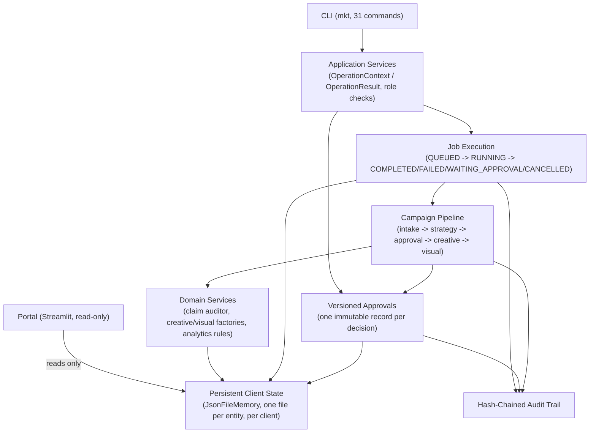

# MARKETING-AGENCY-OS

A deterministic, audit-first backend for running a marketing agency's
operational workflow — intake, strategy, compliance review, creative
drafting, and campaign execution — through a CLI and job system, with
every state change persisted and every decision traceable. Optional
LLM-assisted content generation, gated by human approval before anything
ships.

**REAL EXECUTABLE AGENTS: 0 · SPEC-ONLY AGENTS: 16 · MAX VERIFIED DELEGATION DEPTH: 0**
This is deterministic orchestration with approval-gated execution and
optional LLM-assisted generation — not a multi-agent system. See
[Autonomy Model](#autonomy-model) for what that means in practice.

---

## What It Is

MAOS runs the operational backbone of a marketing agency as code: a
client's intake becomes a strategy, the strategy is audited for
compliance risk before anything is created, creative and visual drafts
are generated from the approved strategy, and every step is persisted
and hash-chained into an audit trail. It is a **CLI-first backend**, not
a SaaS product or a chat interface — the unit of work is a job, not a
conversation.

## Problem It Solves

Agencies (and solo operators running client work) redo the same
structural work per client — briefs, strategy docs, compliance checks,
creative drafts — usually from scratch, in documents that don't track
who approved what or why. MAOS makes that workflow **deterministic and
auditable**: the same intake produces the same pipeline stages every
time, every artifact is versioned, every approval decision is a real,
queryable record instead of a Slack message or a comment in a Google Doc.

## What Works Today

| Capability | Status | Evidence |
|---|---|---|
| CLI (31 commands) as the only entry point | LIVE | `cli/main.py`; every command exit-code tested |
| Job execution (`QUEUED → RUNNING → {COMPLETED, FAILED, WAITING_APPROVAL, CANCELLED}`) | LIVE | `core/jobs/`, 88 tests |
| Versioned approvals (multiple per client, immutable history) | LIVE | `core/approval/`, 129 tests |
| Deterministic campaign pipeline (intake → strategy → approval → creative → visual) | LIVE | `core/pipeline/orchestrator.py` |
| Compliance / claim auditor (22 regex-based rules, no LLM) | LIVE | `core/approval/claim_auditor.py` |
| Read-only Streamlit portal | LIVE | `portal/`, 52 tests incl. 11 structural read-only pins |
| Optional LLM-assisted strategy generation (Anthropic) | PARTIAL | real SDK, lazy-imported, falls back to a deterministic templated backend without an API key |
| GA4 / Search Console / Google Ads connectors | PARTIAL | real SDK code, gated by env credentials — never exercised against a live API in this environment |
| Notion / n8n / image-provider integrations | DRY_RUN | produce the shape of a request; no network call by default |
| Market intelligence adapters (YouTube, Trends, Reddit, Meta Ads) | DRY_RUN | fixture data only, no real API call implemented yet |
| `agents/`, `skills/`, `workflows/` specs | SPEC_ONLY | validated Markdown/YAML (`mkt validate-specs`); no execution engine runs them |
| Engram (semantic/long-term memory backend) | SPEC_ONLY / NOT CONNECTED | every method raises `NotImplementedError` by design |
| HTTP/API layer | PLANNED | no server exists yet in this repo |
| Full suite | LIVE | 2159 tests passing, `ruff check .` clean |
| ARM64 deployment | VALIDATED | full suite + portal passing on a real ARM64 Linux VPS |

## Architecture



This diagram reflects the real call graph, not an aspiration: there is
no component that decides which other component to invoke at runtime —
every arrow is a fixed, deterministic call.

## Execution Model

```
CLI / Portal (adapters)
    -> Application Services (OperationContext in, OperationResult out — the
       only path to a client_slug, so cross-tenant writes are structurally
       impossible, not just discouraged)
        -> Jobs / Approvals / Pipeline (state machines + a fixed six-stage
           pipeline — no dynamic branching beyond one policy gate)
            -> Domain Services (claim auditor, creative/visual factories,
               deterministic analytics rules — no side effects of their own)
                -> Persistent Client State (JsonFileMemory) + Audit Trail
                   (append-only, hash-chained)
```

Every application service returns a structured `OperationResult` with a
stable `ErrorCode` vocabulary — the same contract the CLI and the (future)
API adapter both consume. No service raises a bare exception to its
caller.

## Autonomy Model

**This is deterministic orchestration, not a multi-agent system.**

- **REAL EXECUTABLE AGENTS: 0** — nothing in this repo decides, delegates,
  or calls tools autonomously at runtime.
- **SPEC-ONLY AGENTS: 16** — `agents/*.md` are Markdown role specifications
  with `status: spec_only` declared in their own frontmatter. They are
  validated (`mkt validate-specs`) but never executed. `core/runtime/`
  ships a `ClaudeCodeBackend` stub for a future subagent-spawning
  execution engine — every method raises `NotImplementedError` today.
- **MAX VERIFIED DELEGATION DEPTH: 0** — no component invokes another
  component based on a runtime decision. The pipeline runs the same six
  stages in the same order every time; the only branch is a fixed policy
  check (`blocks_publish`).
- **What the system decides on its own:** whether a claim in generated
  copy matches one of 22 compliance rules, and whether that blocks
  publish. That's it.
- **What needs a human:** every approval decision. `blocks_publish=True`
  halts the pipeline before creative/visual generation until a human
  calls `approve` or `reject` on a specific, versioned approval record.
- **What uses an LLM:** one pipeline stage (strategy generation),
  optional, with a deterministic templated fallback if no API key is
  configured. The LLM generates content within a fixed template — it does
  not choose what happens next.
- **What can produce a real external side effect:** almost nothing yet.
  Notion has a real write path behind `--write --confirm` plus
  credentials, never exercised end-to-end in this environment. n8n,
  image providers, and market-intelligence adapters are dry-run / fixture
  only.

## Memory & Context

- **Operational persistence (real):** `JsonFileMemory` — one JSON file per
  entity, per client, under `data/clients/<slug>/`. Jobs, versioned
  approvals, metrics snapshots, and the audit trail all live here. This
  is the only persistence backend actually used.
- **Conversational memory:** does not exist. There is no chat session or
  conversation history.
- **Semantic memory / embeddings / vector search / RAG:** does not exist.
  No embedding calls, no vector store, anywhere in `core/`. Reading a
  JSON file back from disk is not RAG, and this README doesn't call it
  that.
- **Engram:** present as an unused adapter stub (`core/memory/engram.py`).
  Every method raises `NotImplementedError`; the docstring says the real
  connector is scheduled for a future block. Not connected, not used.

## Human-in-the-Loop & Guardrails

| Guardrail | Protects | Does not protect |
|---|---|---|
| `blocks_publish` approval gate | Halts creative/visual generation when the claim auditor flags unapproved risk | No publisher consults it yet — it's policy, enforced only inside this pipeline |
| Role checks (`check_can_decide_approval`, `check_can_execute_job`) | Restricts who can approve/reject/execute jobs, by declared role | Roles aren't authenticated yet — there's no login system in front of the CLI |
| `sanitize_params` | Redacts fields an operation declares sensitive before persisting job params | Only covers explicitly declared fields, not a generic secret scanner |
| Path containment (`PATH_NOT_ALLOWED`) | Rejects artifact writes that resolve outside the configured output root | Doesn't cover every file-reading CLI flag (e.g. local `--input` paths) |
| Tenant isolation via `OperationContext` | Every service call is scoped to one validated `client_slug` — structurally, not by convention | Logical isolation inside one process, not an OS-level sandbox |
| Claim auditor (22 rules) | Flags guaranteed-outcome, medical, financial, and similar high-risk language before publish | Regex-based — catches known patterns, not paraphrases |

## Failure Handling

- **Automatic retry:** No. A failed job stays `FAILED`; nothing retries it.
- **Automatic resume:** No. A job in `WAITING_APPROVAL` requires a manual
  resubmit after a decision — this is a deliberate design choice, not a
  missing feature.
- **Fallbacks (not retries):** the strategy backend falls back from
  Claude to a deterministic templated generator; analytics connectors
  fall back to "unavailable" when credentials are missing. Both change
  strategy, not attempt count.
- **Idempotency:** re-running a `COMPLETED` job, re-approving an already
  `APPROVED` record, or re-rejecting an already `REJECTED` one all
  succeed as no-ops with a warning, not an error.
- **Malformed/missing input:** mapped to structured `ErrorCode` values
  (`INVALID_INPUT`, `NOT_FOUND`, `PERSISTENCE_ERROR`, ...) — no bare
  tracebacks reach a caller.

## Integrations

| Integration | Status | Notes |
|---|---|---|
| Anthropic Claude (strategy backend) | PARTIAL | real SDK, optional, graceful fallback |
| GA4 | PARTIAL | real SDK, read-only, credential-gated, not exercised end-to-end here |
| Google Search Console | PARTIAL | same |
| Google Ads | PARTIAL | same |
| Notion | DRY_RUN by default / real write path exists but unverified end-to-end | requires explicit `--write --confirm` + credentials |
| n8n | DRY_RUN | produces a payload shape only |
| Image providers | DRY_RUN | scores providers, generates nothing |
| ATLAS bridge | Handoff artifact only | no live call into ATLAS, ever |
| YouTube / Google Trends / Reddit / Meta Ads adapters | DRY_RUN (fixture data) | interface exists, no real API call implemented |
| MCP | NOT_CONNECTED | no MCP client anywhere in this repo |

**"Implementation exists" is not the same claim as "verified working
integration"** — this table keeps that distinction explicit everywhere it
applies.

## Evidence & Testing

```
$ pytest
2159 passed

$ ruff check .
All checks passed!
```

- 88 job tests, 129 approval tests (domain + application layer), 52
  portal tests (11 of them structural pins enforcing the read-only
  contract), 5 contract tests, 0 tests marked `integration` — meaning no
  test in this suite exercises a live external system.
- CI (GitHub Actions) runs `ruff check .` and the full non-integration
  suite on every push/PR to `main`.
- **Auditability vs. observability, kept distinct:** the audit trail
  (append-only, hash-chained, with `job_id`/`correlation_id`/`approval_id`
  correlated end-to-end) gives strong business auditability — you can
  reconstruct exactly which job triggered which approval and who decided
  it. There is no observability stack: no OpenTelemetry, no metrics, no
  distributed tracing, no alerting. The audit trail answers "what
  happened and who decided it," not "how is the system performing."

## Deployment / Runtime

- Python 3.11+ (CI-tested on 3.11; also validated locally on 3.14).
- No Docker image exists in this repository yet.
- **Validated on a real Linux ARM64 VPS staging environment**: Python
  3.12.3, `pip install -e ".[dev,portal]"`, the full 2159-test suite,
  `ruff check .`, and the portal all passed natively. (No IPs, hostnames,
  or infrastructure details are recorded anywhere in this repo.)
- Client state (`data/clients/`) and generated outputs (`outputs/`) are
  the only stateful directories — both are local JSON/Markdown files,
  gitignored except for structural placeholders.

## Engineering Decisions

- **Deterministic core before autonomous execution.** Every stage the
  system runs today is a fixed function, not a model deciding what to do
  next — autonomy is opt-in per stage (currently: strategy generation
  only) and always has a deterministic fallback.
- **A single application-service boundary.** CLI and any future adapter
  (API, portal writes) go through the same `OperationContext` /
  `OperationResult` contract — no adapter-specific business logic.
- **Versioned, immutable approvals.** Approval history was originally a
  single-record-per-client design; it was deliberately migrated to a
  versioned model so a new pipeline run can never silently invalidate a
  prior human decision.
- **Persistent, replayable job state.** One file per job, never
  overwritten in place except by its own state transitions — full job
  history survives every run.
- **Approval-gated execution**, not permission-less generation — creative
  and visual stages are skipped, not silently degraded, when an approval
  blocks publish.
- **Secret sanitization at the persistence boundary**, not left to each
  caller to remember.
- **Logical tenant isolation** enforced by construction (`OperationContext`
  is the only path to a `client_slug`), not by convention or code review.
- **Correlated audit trail** — `job_id` and `correlation_id` were
  deliberately threaded through the pipeline so a job, its audit events,
  and its resulting approval can always be reconstructed together.
- **GitHub as the single source of truth** for what's actually
  implemented — this README is written from the code and test suite, not
  the other way around.
- **ARM64 staging validation before any deployment automation** — the
  runtime was proven on the actual target architecture before writing a
  single line of Docker/deployment tooling.

## Current Limitations

This section is deliberately explicit:

- **No agent execution engine.** `agents/`, `skills/`, and `workflows/`
  are specifications only. There is no orchestration engine that reads
  one of these specs and executes it as an autonomous agent.
- **No HTTP/API layer.** The CLI is the only supported entry point today.
- **No automatic retry or resume.** Failures and approval-pauses both
  require a human/operator action to proceed.
- **No real-time or async job execution.** `InlineJobRunner` is
  synchronous, single-process — no queue, no worker pool, no concurrency.
- **No observability stack.** Strong audit trail, no metrics/tracing/alerts.
- **No semantic memory, no RAG, no vector search.**
- **Most external integrations are unverified end-to-end.** GA4/Search
  Console/Google Ads/Notion have real SDK code but were never exercised
  against a live account or credential set in this environment. Treat
  them as "implemented, not proven" until run against real credentials.
- **No authentication.** Roles exist in the domain model but aren't tied
  to any real login/session system.
- **No Docker image or deployment automation** in this repository yet —
  only a validated ARM64 runtime environment.

## Roadmap

1. **HTTP/API foundation** — a minimal, read-only-first API layer over
   the existing application services (design already audited; not yet
   implemented).
2. **Data + Evidence foundation** — a repository abstraction and an
   evidence model, groundwork for an eventual Postgres/Supabase adapter
   alongside the current JSON file store.
3. **Website Intelligence** — deterministic site/competitor discovery.
4. **A free marketing audit tool**, built on the above.
5. **An operational Control Center UI**, separate from the read-only
   portal — not started.

Nothing above is implemented. It's listed here as direction, not status.

---

## Quick Start / Development

Requires Python **3.11+**.

```bash
git clone <repo-url>
cd MARKETING-AGENCY-OS

python -m venv .venv
# Windows: .venv\Scripts\activate    macOS/Linux: source .venv/bin/activate

pip install -e ".[dev]"
```

Optional extras, install only what you need:

```bash
pip install -e ".[claude]"    # Anthropic SDK, for --backend claude
pip install -e ".[notion]"    # notion-client SDK, for notion-sync --write --confirm
pip install -e ".[portal]"    # Streamlit, for `mkt portal`
```

Copy `.env.example` to `.env` and fill in only what you need — every
integration degrades gracefully without credentials.

```bash
mkt --help
mkt list-workflows
mkt validate-specs

mkt intake --file examples/intake/demo-business.json --client demo-saas --root data/clients
mkt run-campaign --intake examples/intake/demo-business.json --root data/clients --outputs-dir outputs
mkt approvals list --root data/clients
mkt approve --client demo-saas --root data/clients --actor lucas
```

```bash
ruff check .
pytest
```

Do not run more than one `pytest` process concurrently against the same
working tree.

```bash
pip install -e ".[portal]"
mkt portal --root data/clients --outputs-dir outputs
```

## Relationship to ATLAS

Independent repo, independent git history. ATLAS does not depend on
MAOS, and MAOS runs standalone with zero ATLAS components. `core/atlas_bridge/`
produces a handoff artifact for a human to carry into ATLAS manually —
never a live call. See [`docs/relation-to-atlas.md`](docs/relation-to-atlas.md).

## License

Proprietary. All rights reserved.
